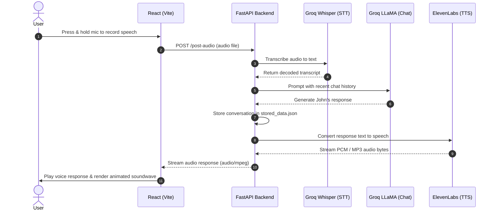

# John &bull; Neural AI Voice Companion & Interviewer

An end-to-end full-stack AI Voice Assistant built with **React**, **FastAPI**, **Groq (Whisper & LLaMA)**, and **ElevenLabs**. John serves as a realistic AI interviewer who listens to your voice, analyzes your responses, and responds in real time with high-fidelity streaming audio.

---

## Architecture & Data Flow



---

## Features

- **Full Voice Loop**: Speak naturally into your microphone and hear John speak back immediately.
- **Ultra-Fast Transcription**: Powered by Groq's high-speed Whisper Large v3 speech-to-text inference.
- **Dynamic AI Persona**: John acts as a retail job interviewer with adaptive personality traits (enthusiastic or witty dry humor).
- **Realistic Voice Synthesis**: Lifelike speech generated using ElevenLabs neural voice models.
- **Custom Soundwave Visualizer**: 18-bar frequency equalizer with interactive play/pause controls and exact duration calculation.
- **Conversation Memory**: Remembers previous question-answer context with a quick-reset feature (`GET /reset`).
- **Cyberpunk / Glassmorphic UI**: High-end dark theme built with Tailwind CSS, glowing ambient nebulae, and sonar pulse recording orb.

---

## Tech Stack

| Layer         | Technologies                                                          |
| ------------- | --------------------------------------------------------------------- |
| **Frontend**  | React 19, TypeScript, Vite, Tailwind CSS, Axios, React Media Recorder |
| **Backend**   | Python 3.14, FastAPI, Uvicorn, Python-Decouple, Python-Dotenv         |
| **AI Models** | Groq (`whisper-large-v3`, `openai/gpt-oss-20b`), ElevenLabs TTS       |

---

## Quick Start

### 1. Prerequisites

- **Node.js**: v18+ installed
- **Python**: v3.10+ installed (Python 3.14 recommended)
- **API Keys**:
  - [Groq Cloud](https://console.groq.com/) API key
  - [ElevenLabs](https://elevenlabs.io/) API key & Voice ID

---

### 2. Backend Setup

```bash
cd backend

# Create virtual environment and install dependencies
python -m venv venv
.\venv\Scripts\activate   # On Windows (or source venv/bin/activate on Linux/macOS)
pip install -r requirements.txt  # Or use uv sync / uv pip install

# Configure environment variables
cp .env.example .env
```

Edit `backend/.env`:

```env
GROQ_API_KEY=your_groq_api_key_here
ELEVENLABS_API_KEY=your_elevenlabs_api_key_here
ELEVENLABS_VOICE_ID=your_elevenlabs_voice_id_here
CORS=http://localhost:5173
```

Run the backend server:

```bash
uvicorn main:app --reload
```

Backend runs at `http://localhost:8000`.

---

### 3. Frontend Setup

```bash
cd frontend

# Install dependencies
npm install

# Configure environment variables
cp .env.example .env
```

Edit `frontend/.env`:

```env
VITE_API_URL=http://localhost:8000
```

Start the Vite development server:

```bash
npm run dev
```

Frontend runs at `http://localhost:5173`.

---

## Repository Structure

```
fastapi-react-voice-assistant/
├── backend/
│   ├── functions/
│   │   ├── database.py         # Chat history storage & memory reset
│   │   ├── openai_requests.py  # Groq Whisper transcription & chat completion
│   │   └── text_to_speech.py   # ElevenLabs voice generation
│   ├── main.py                 # FastAPI app & endpoints (/health, /post-audio, /reset)
│   ├── pyproject.toml          # Python project specification
│   └── stored_data.json        # Persistent conversation history
├── frontend/
│   ├── public/
│   │   └── favicon.svg         # Glowing AI microphone favicon
│   ├── src/
│   │   ├── components/
│   │   │   ├── AudioBubble.tsx   # Custom soundwave player & duration timer
│   │   │   ├── Controller.tsx    # Main state orchestration & chat feed
│   │   │   ├── RecordIcon.tsx    # Microphone SVG with live recording ping
│   │   │   ├── RecordMessage.tsx # Recording button orb with sonar rings
│   │   │   └── Title.tsx         # Fixed navigation bar with reset button
│   │   ├── App.tsx
│   │   ├── index.css             # Glassmorphism utilities & keyframes
│   │   └── main.tsx
│   └── package.json
└── README.md
```
